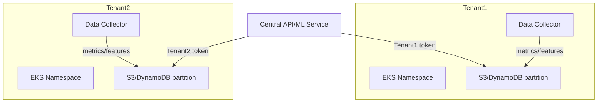

#  How the Solution Scales Across Multiple Tenants with Isolation Guarantees

## Overview

The platform is architected for multi-tenant SaaS use, ensuring each tenant’s data is segregated, secure, and logically isolated at every layer of the system. This design enables seamless onboarding of new customers while meeting enterprise requirements for data privacy, security, and regulatory compliance.

---

## Multi-Tenancy Architecture

### **Isolation Strategies**

- **Namespace and Account Isolation:**
    - Each tenant’s workloads run in dedicated Kubernetes namespaces, EKS clusters, or even AWS accounts where required.
- **Data Partitioning:**
    - Metrics, features, and recommendations are always tagged with a unique tenant ID.
    - Storage systems (S3, DynamoDB, RDS, etc.) use strict partitioning by tenant.
- **Per-Tenant Service Accounts and IAM Roles:**
    - Agents and microservices use credentials that are scoped per namespace/tenant, enforcing least privilege on AWS resources and platform APIs.

---

### **Data Flow Isolation**

- **On Collection:**
    - Metrics agents deployed into each tenant’s namespace (as DaemonSet or Sidecar).
    - Data is tagged and/or written to tenant-specific object storage locations (e.g., `s3://bucket/tenantID/`).
- **Data Pipeline:**
    - Processing jobs and ML batch runs execute independently per tenant, or with strict partitioning in multi-tenant workloads.
- **Recommendation Storage:**
    - Recommendation databases (DynamoDB/RDS) use partition key on `tenant_id`, preventing data leakage.
- **Serving/API Layer:**
    - The REST API requires authentication with JWT/OAuth/tenant tokens, and filters all responses by allowed tenant(s).

---

### **Access Control & Security**

- **Strong Authentication:**
    - All data access and API requests are authenticated (JWT/OAuth), with tenant identity enforced at the authorization layer.
- **Row-level Security:**
    - For services like PostgreSQL, row-level security is enabled, restricting queries by authenticated tenant.
- **Least Privilege IAM:**
    - Credentials are limited to the minimum permissions necessary for each component and tenant.
- **Network Isolation:**
    - Network policies (Kubernetes NetworkPolicy, AWS Security Groups) disable cross-tenant traffic by default.

---

### **Scalability Patterns**

- **Horizontal Scaling:**
    - Data collectors, preprocessors, and ML inference services are stateless and horizontally scalable; each can be sharded per tenant, per cluster, or per region as needed.
- **Resource Quotas:**
    - Kubernetes ResourceQuota and LimitRange ensure that one tenant cannot affect platform stability or performance for others.
- **Storage Partitioning:**
    - S3, DynamoDB, and RDS scale automatically as new tenants are onboarded; partitioning prevents "hot spots".

---

### **Compliance & Auditability**

- **Audit Logging:**
    - Every data access, API call, and model recommendation is logged with tenant context.
- **Encryption Everywhere:**
    - All sensitive data is encrypted in transit (TLS) and at rest (S3 SSE-KMS, RDS/DynamoDB encryption).
- **Isolation Validation:**
    - Integration and security tests (e.g., “can tenant A access tenant B’s data?”) are part of every release pipeline.

---

### **Visual Overview**

---

## Summary Table

| Isolation Layer         | Mechanism                        | Enforced By              |
|------------------------ |----------------------------------|--------------------------|
| Namespace/Cluster       | K8s Namespace, EKS, AWS Account  | Platform, IAC (Terraform)|
| Data                    | Partitioning, keys, folder paths  | S3, DDB, RDS policies   |
| API                     | JWT/OAuth, per-tenant filter      | API Gateway, Middleware |
| Compute                 | Node pools, quotas                | K8s Scheduler           |
| Access Control          | IAM, RBAC, row-level security     | Cloud + K8s Policies    |

---

## Key Benefits

- **Zero data leakage between tenants**
- **Scalable onboarding of any number of new customers**
- **Regulation- and compliance-ready architecture**
- **Performance and stability guarantees per tenant**
